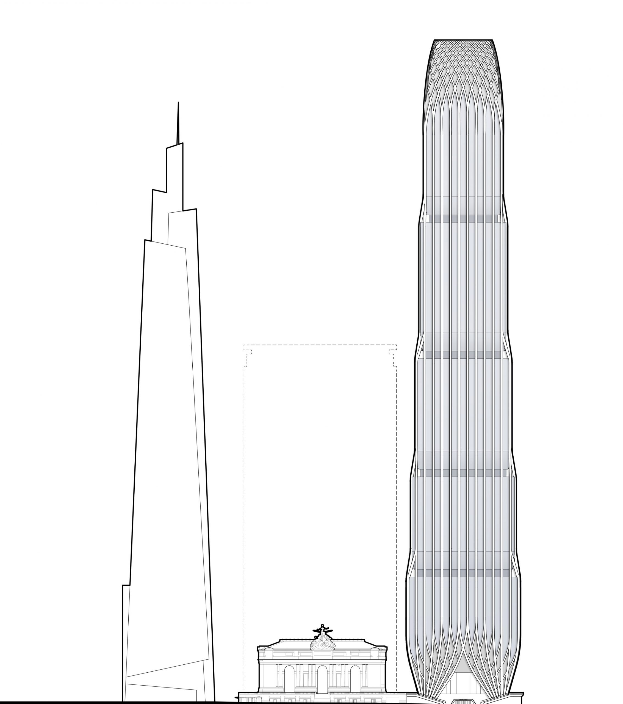

# 175 Park Ave 3D Model

This 3d model is an attempt to sketch 175 Park Ave with incomplete information about the dimensions and shape of the building. There are likely some inaccuracies. 

## Link
https://meliharvey.github.io/175-park-ave/

## Sources

NYC 3d Model from NYC Open Data
https://www1.nyc.gov/site/planning/data-maps/open-data/dwn-nyc-3d-model-download.page

One Vanderbilt Model from 3D Warehouse:
https://3dwarehouse.sketchup.com/model/u6ffc6b60-eead-4cce-bc84-793f3726ebb4/New-York-1-Vanderbilt?hl=en

175 Park Ave based on the drawing from SOM

